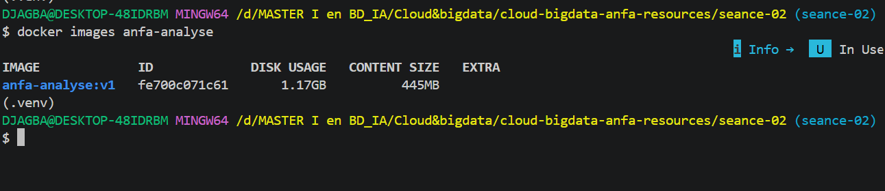
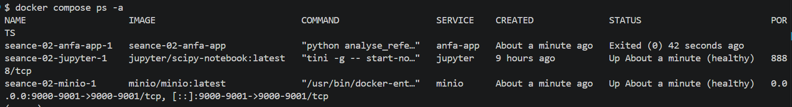
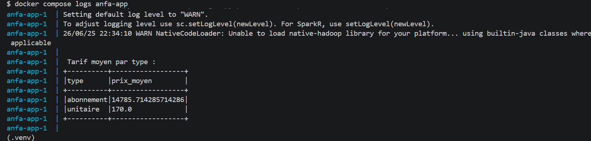
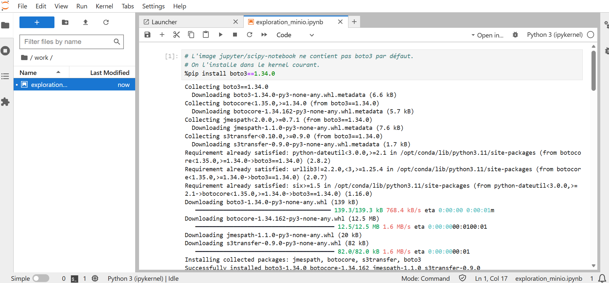
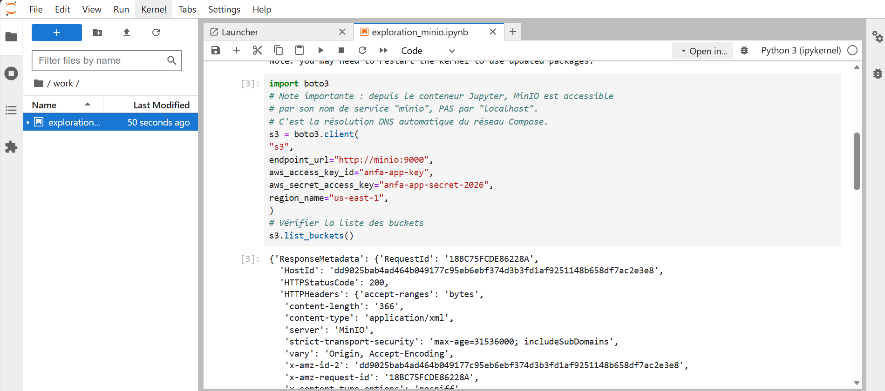
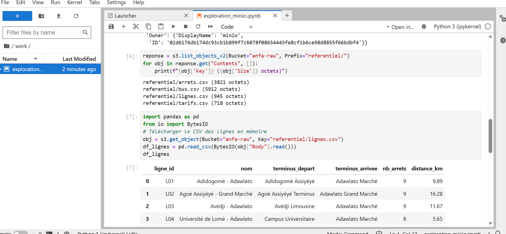

Nom : DJAGBA Kuinambe Véronique
Identifiant GitHub : DJAGBA
Date de soumission :26/06/2026

## Résumé de la séance 2

Durant cette deuxième séance, j'ai compris que la conteneurisation, portée par Docker, est une solution très efficace pour résoudre le problème classique du "ça marche sur ma machine, mais pas ailleurs". Contrairement aux machines virtuelles qui sont lourdes car elles embarquent un système d'exploitation entier, Docker utilise les fonctionnalités natives du noyau Linux (les namespaces pour l'isolation et les cgroups pour la gestion des ressources) afin de créer des conteneurs beaucoup plus légers et rapides. Ce que j'ai surtout retenu, c'est que la vraie révolution de Docker n'est pas technologique, mais ergonomique : grâce au Dockerfile, à la simplicité des commandes et aux registres d'images, on peut désormais packager une application avec toutes ses dépendances pour la déployer partout de manière identique. C'est cette standardisation, combinée à l'orchestration avec Docker Compose, qui permet aujourd'hui de gérer facilement des architectures complexes.

## Captures d'écran du notebook

## Exercices d'application

### Exercice 1 : QCM conceptuel

1.1.C. Un conteneur utilise le noyau de l'hôte
Justification : contrairement à une machine virtuelle qui possède son propre noyau via un hyperviseur.

1.2.B. L'image est un modèle figé en lecture seule ; le conteneur est une instance en cours d'exécution.

1.3.B. Les namespaces
Justification : ils permettent d'isoler les ressources système (réseau, processus, montages) pour chaque conteneur.

1.4.A. Les cgroups
Justification : ils permettent de limiter et de mesurer la consommation de ressources (CPU, RAM).

1.5.B. Dans une machine virtuelle Linux invisible gérée par Docker Desktop
Justification : il utilise une machine virtuelle légère pour exécuter le moteur Docker qui nécessite le noyau Linux.

1.6.B. La société d'origine qui a créé et open-sourcé Docker en 2013.
Justification : DotCloud était le nom de la société PaaS qui a créé Docker avant de se concentrer exclusivement sur ce projet.

1.7.C. Docker a apporté un format d'image portable, une CLI simple et un registre public, en s'appuyant sur les mêmes primitives que LXC.
Justification : Docker a standardisé l'écosystème en se basant sur les primitives d'isolation déjà existantes.

1.8.B. Open Container Initiative — une norme ouverte pour les images et le runtime
Justification : l'OCI définit les standards ouverts pour que les conteneurs soient interopérables entre les différents outils.

### Exercice 2 : Lecture et analyse d'un Dockerfile

2.1 Explication des instructions**

- `FROM` : définit l'image de base utilisée pour construire l'image.
- `WORKDIR` : définit le répertoire de travail dans le conteneur.
- `COPY` : copie les fichiers de la machine hôte vers le conteneur.
- `RUN` : exécute une commande durant la construction de l'image.
- `EXPOSE` : indique que le conteneur écoute sur ce port (documentatif).
- `CMD` : définit la commande par défaut au démarrage du conteneur.

2.2 Différence EXPOSE vs -p 5000:5000**

`EXPOSE` est purement déclaratif (documentation), tandis que l'option `-p 5000:5000` réalise la translation de port nécessaire pour rendre le port du conteneur accessible depuis l'extérieur.

2.3 Problèmes et corrections**

- Utilisation de root : le processus tourne avec l'utilisateur root par défaut.
  Correction : créer un utilisateur non-privilégié avec `USER`.
- Ordre des couches : copier tout le répertoire avant `pip install` invalide le cache à chaque modification de code.
  Correction : copier uniquement `requirements.txt` d'abord.

2.4 Version corrigée**

FROM python:3.11-slim
WORKDIR /application
# Optimisation du cache : on ne réinstalle que si requirements change
COPY requirements.txt .
RUN pip install --no-cache-dir -r requirements.txt
COPY . .
# Sécurité : utilisateur non-root
RUN useradd -m appuser
USER appuser
EXPOSE 5000
CMD ["python", "main.py"]

### Exercice 3 : Diagnostic

3.1 Le build qui échoue

a. Le `RUN pip install` est exécuté avant le `COPY . .`. Le fichier `requirements.txt` n'est pas encore présent dans le système de fichiers du conteneur.

b. Il faut déplacer l'instruction `COPY requirements.txt .` avant `RUN pip install`.

c. Cela illustre que chaque ligne d'un Dockerfile crée une couche isolée : le contexte du build n'est accessible que si les fichiers ont été explicitement copiés dans l'image.

3.2 Le conteneur qui ne voit pas l'autre

a. `localhost` désigne le conteneur `api` lui-même, pas le service `db`.

b. Remplacer `localhost` par le nom du service : `postgresql://user:password@db:5432/anfa`.

### Exercice 4 : Optimisation d'image

a. Problèmes identifiés

1. `ubuntu:22.04` est trop lourd comme image de base.
2. Les commandes `apt-get` sont séparées, ce qui invalide le cache inutilement.
3. Installation de packages inutiles (`git`, `build-essential`, `wget`).
4. Tout le code est copié avant `pip install`, ce qui invalide le cache à chaque modification.
5. Pas d'utilisateur non-root (risque de sécurité).
6. Pas de `--no-cache-dir` sur pip, ce qui augmente la taille de l'image.

b. Version optimisée

FROM python:3.11-slim
# Image légère au lieu de ubuntu:22.04

RUN apt-get update && \
    apt-get install -y --no-install-recommends curl && \
    rm -rf /var/lib/apt/lists/*
# Nettoyage du cache apt pour réduire la taille de l'image

WORKDIR /app

COPY requirements.txt .
# Copie requirements avant le code pour optimiser le cache

RUN pip install --no-cache-dir -r requirements.txt
# --no-cache-dir réduit la taille de l'image

COPY . .

# Sécurité : utilisateur non-root
RUN useradd -m appuser
USER appuser

CMD ["python", "downloader.py"]

### Exercice 5 : Mini-cas d'architecture

a. Services à conteneuriser

- `worker` : exécute le script Python de traitement (batch nocturne).
- `minio` : stockage objet pour les données.
- `jupyter` : interface d'exploration des données.

b. Restart policy

`on-failure` — le script n'a pas besoin de tourner en continu. S'il échoue, on veut qu'il réessaie, mais une fois terminé, il doit s'arrêter proprement.

c. Passer la date

1. Variable d'environnement (`DATE=2026-06-23` dans `environment:`).
2. Argument de ligne de commande via `command:` au lancement.

Recommandé : variable d'environnement, plus simple à injecter via `docker run -e` ou un fichier `.env`.

d. Pourquoi un conteneur séparé pour le pipeline

Le script de traitement et Jupyter ont des cycles de vie et des besoins en ressources différents. Séparer permet de ne pas surcharger Jupyter avec les dépendances du pipeline et de garantir que le crash de l'un n'affecte pas l'autre.

e. Squelette docker-compose.yml

  yaml
services:
  minio:
    image: minio/minio
    command: server /data --console-address ":9001"
    ports:
      - "9000:9000"
      - "9001:9001"
    volumes:
      - minio-data:/data

  worker:
    build: ./pipeline
    environment:
      - DATE=2026-06-23
    depends_on:
      - minio

  jupyter:
    image: jupyter/datascience-notebook
    volumes:
      - ./notebooks:/home/jovyan/work
    ports:
      - "8888:8888"
    depends_on:
      - minio

volumes:
  minio-data:

