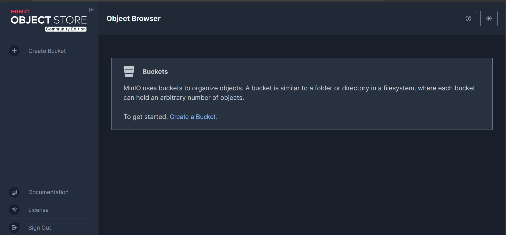
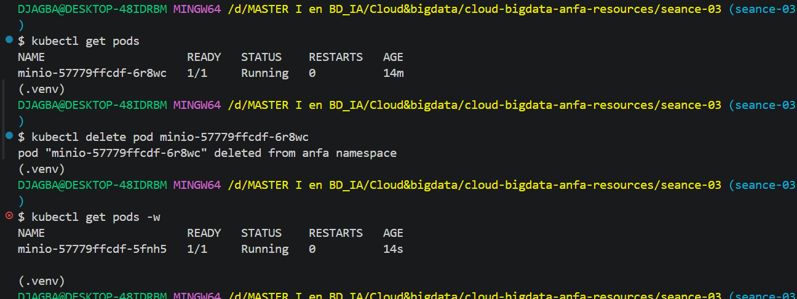
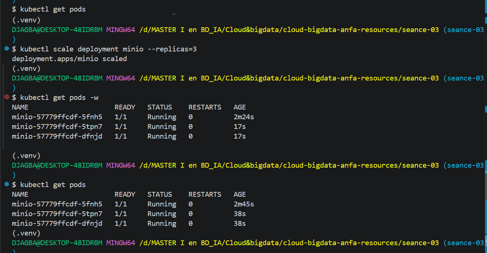

## Nom et prénom :DJAGBA Kuinambe Véronique
## Identifiant GitHub :DJAGBA
## Date de soumission: 26/06/2026

## Résumé de la séance-03

Kind installé via winget et configuré dans Git Bash. Cluster Kubernetes "anfa" 
créé avec l'image kindest/node:v1.35.1. Namespace "anfa" configuré et MinIO 
déployé via 3 manifestes YAML (PVC, Deployment, Service). Self-healing observé 
après suppression manuelle d'un pod et scaling testé de 1 à 3 replicas.

## Captures d'écran

### Console MinIO accessible via port-forward

### Self-healing observé

### Scaling à 3 replicas

## Réponses aux exercices d'application
Exercice 1 : QCM conceptuel

1.1.B. Kubernetes orchestre des conteneurs sur un cluster de machines, en s'appuyant sur un container runtime.
Justification : Kubernetes ne remplace pas Docker, il l'utilise comme runtime pour gérer les conteneurs.

1.2.B. etcd
Justification : etcd est la base de données clé-valeur qui stocke tout l'état du cluster.

1.3.C. Scheduler
Justification : Le Scheduler analyse les ressources disponibles et décide sur quel nœud placer un nouveau pod.

1.4.C. À l'API Server
Justification : L'API Server est le point d'entrée unique du cluster, toutes les commandes kubectl lui sont adressées.

1.5.B. Le Deployment recrée immédiatement un nouveau pod pour respecter l'état souhaité.
Justification : C'est le self-healing — le Controller Manager détecte l'écart et recrée le pod automatiquement.

1.6.B. NodePort
Justification : NodePort expose le service sur un port de chaque nœud du cluster, accessible depuis l'extérieur sans load balancer cloud.

1.7.B. Elle modifie l'état souhaité du Deployment à 5 replicas ; Kubernetes converge vers ce nombre.
Justification : Kubernetes compare l'état souhaité (5) à l'état observé et crée ou supprime des pods en conséquence.

1.8.B. À isoler logiquement les ressources.
Justification : Les namespaces permettent de séparer les ressources par équipe, environnement ou application dans un même cluster.

1.9.B. Des conteneurs Docker.
Justification : Kind (Kubernetes IN Docker) crée des nœuds Kubernetes sous forme de conteneurs Docker sur la machine hôte.

Exercice 2 : Lecture et interprétation d'un manifeste

2.1 selector.matchLabels indique au Deployment quels pods il doit gérer ; 
template.metadata.labels donne les labels aux pods créés. 
Les deux doivent correspondre pour que le Deployment reconnaisse ses pods.

2.2 pods seront créés (replicas: 2). Si l'un meurt, le Controller Manager 
détecte l'écart et recrée automatiquement un nouveau pod.

2.3 minio est le nom du Service Kubernetes qui pointe vers les pods MinIO. 
La résolution est possible grâce au DNS interne de Kubernetes (CoreDNS), 
qui résout automatiquement les noms de services en adresses IP.

2.4 Sans Service, l'API n'est accessible que depuis l'intérieur du cluster 
via l'IP du pod, qui change à chaque redémarrage. Elle n'est pas joignable 
depuis l'extérieur ni de façon stable.

2.5 Manifeste Service :
 yaml
apiVersion: v1
kind: Service
metadata:
  name: anfa-api
  namespace: anfa
spec:
  type: ClusterIP
  selector:
    app: anfa-api
  ports:
    - port: 80
      targetPort: 8000

Exercice 3 : Diagnostic

3.1

a. ImagePullBackOff signifie que Kubernetes n'arrive pas à télécharger l'image 
   du conteneur depuis le registre.
b. La cause est une faute de frappe dans le nom de l'image : "miniooo" 
   au lieu de "minio".
c. kubectl describe pod minio-7d9f8b6c5-x2k9p

3.2
a. Pending signifie que le PVC n'a pas encore trouvé de PersistentVolume 
   disponible pour satisfaire sa demande.
b. La cause probable est que 500Gi est trop grand — le provisioner local 
   de Kind ne peut pas fournir autant de stockage sur une machine locale.
c. kubectl describe pvc data-pvc

3.3
a. Le port-forward échoue car le pod n'est pas encore en état Running — 
   on ne peut pas rediriger du trafic vers un pod qui n'est pas prêt.
b. kubectl describe pod <nom-du-pod>
c. L'ordre logique : 
1) appliquer le PVC 
2) appliquer le Deployment 
3) attendre que le pod soit Running 
4) lancer le port-forward.

Exercice 4 : De Docker Compose à Kubernetes

4.1
- PersistentVolumeClaim : gère le stockage persistant (équivalent du volume nommé)
- Deployment : décrit le pod MinIO et son cycle de vie
- Service : expose MinIO sur le réseau du cluster

4.2 Un volume Docker nommé est géré localement par Docker sur la machine hôte, 
sans notion de capacité ni de classe de stockage. Un PVC Kubernetes est une 
demande formelle de stockage avec une taille et un mode d'accès définis ; 
Kubernetes trouve et lie automatiquement un PersistentVolume correspondant, 
indépendamment du nœud sur lequel tourne le pod.

4.3 Avec Docker Compose, le port est directement mappé sur l'hôte. Avec Kind, 
le NodePort n'est pas accessible depuis l'hôte car les nœuds sont des conteneurs 
Docker sans exposition directe. Le port-forward de kubectl crée un tunnel temporaire. 
Pour un accès direct comme Compose, il faudrait configurer Kind avec extraPortMappings 
dans son fichier de configuration.

4.4 Deux apports observés concrètement :
- Self-healing : Kubernetes a recréé automatiquement le pod supprimé sans intervention.
- Scaling : en une seule commande, on est passé de 1 à 3 replicas instantanément.

Exercice 5 : Mini-cas d'architecture
5.1
- pipeline-anfa → CronJob : tâche planifiée qui s'exécute chaque nuit à 2h et se termine.
- anfa-api → Deployment : application stateless toujours disponible, scalable horizontalement.
- anfa-dashboard → Deployment : application web stateless à disponibilité standard.

5.2 Paramètres HPA pour anfa-api :
- minReplicas: 2 (toujours disponible, jamais en dessous de 2)
- maxReplicas: 10 (absorber les pics matin/soir à 50 req/s)
- métrique cible : CPU à 60%

Justification : le profil de charge varie fortement entre les heures de pointe 
(50 req/s) et le reste (5 req/s), l'autoscaler ajuste automatiquement le nombre 
de pods selon la charge CPU.

5.3 LoadBalancer — anfa-api est exposée aux applications mobiles externes, 
un LoadBalancer cloud fournit une IP publique stable et distribue le trafic 
entre les pods.

5.4 Par défaut, Kubernetes utilise une stratégie RollingUpdate : il crée 
progressivement les nouveaux pods avant de supprimer les anciens. À aucun moment 
tous les pods ne sont indisponibles simultanément. Le Service continue de router 
le trafic vers les anciens pods jusqu'à ce que les nouveaux soient prêts (Ready), 
garantissant ainsi zéro coupure de service.

5.5 Manifeste Deployment anfa-api :
  yaml
apiVersion: apps/v1
kind: Deployment
metadata:
  name: anfa-api
  namespace: anfa
spec:
  replicas: 3
  selector:
    matchLabels:
      app: anfa-api
  template:
    metadata:
      labels:
        app: anfa-api
    spec:
      containers:
        - name: api
          image: anfa/api:v1
          ports:
            - containerPort: 8000
          env:
            - name: MINIO_ENDPOINT
              value: "http://minio:9000"
