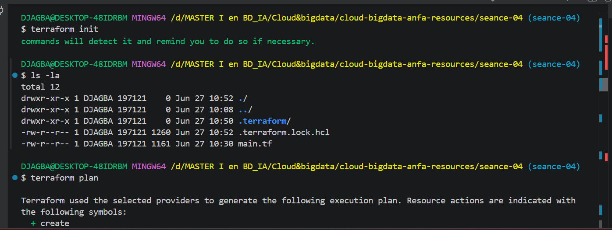
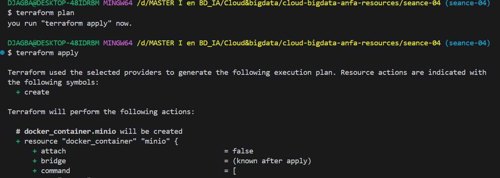
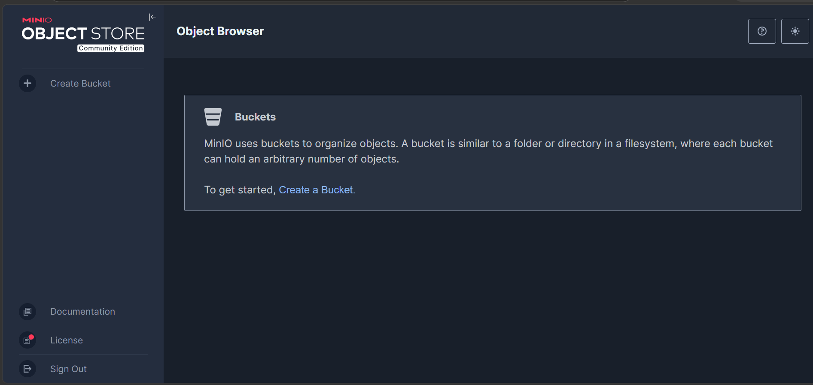
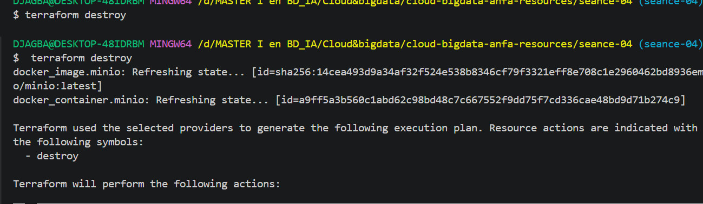
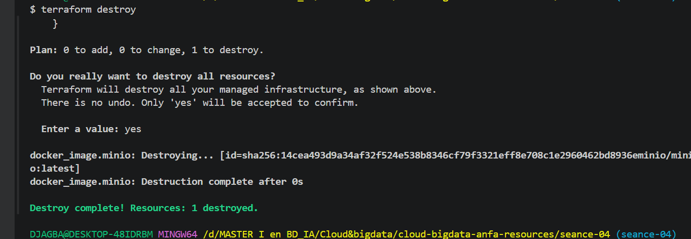

# Nom : DJAGBA Kuinambe Véronique
# Identifiant GitHub : DJAGBA
# Date de soumission : 27/06/2026

## Résumé de la séance 4

Durant cette quatrième séance, j'ai découvert l'Infrastructure as Code (IaC) avec Terraform. J'ai compris que décrire son infrastructure dans des fichiers texte versionnés dans Git apporte les mêmes avantages que le code applicatif : reproductibilité, traçabilité et collaboration. Contrairement à une configuration manuelle via une interface graphique, Terraform adopte une approche déclarative — on décrit l'état souhaité, et c'est l'outil qui détermine les actions nécessaires pour y parvenir. Ce qui m'a le plus marqué,c'est le concept d'idempotence : appliquer le même code deux fois produit toujours le même résultat, sans effets de bord. Grâce au fichier terraform.tfstate, Terraform mémorise ce qu'il a créé et ne recrée que ce qui a changé. J'ai aussi compris l'importance de ne jamais committer ce fichier de state sur Git, car il peut contenir des secrets en clair. En pratique, j'ai reproduit en Terraform la stack MinIO de la séance 2 : réseau, volume et conteneur — ce qui m'a permis de mesurer concrètement la puissance et la lisibilité du langage HCL.

## Captures d'écran

### terraform plan (création initiale)

### terraform apply réussi

### Console MinIO créée par Terraform

### terraform destroy

## Exercices d'application

### Exercice 1 : QCM conceptuel

1.1.B. L'IaC ne remplace pas la compréhension de l'infrastructure sous-jacente ;
Justification : elle automatise sa gestion, mais le praticien doit toujours savoir ce qu'il
déploie et comprendre les ressources qu'il crée.

1.2.B.
Le déclaratif décrit l'état final souhaité (« je veux un conteneur qui tourne ») ;
Justification : l'impératif décrit la séquence d'actions à effectuer pour y arriver (« lance cette commande, puis celle-là »). Terraform est déclaratif.

1.3.B.Une opération idempotente produit toujours le même résultat, qu'elle soit appliquée une ou dix fois. 
Justification : C'est le cas de `terraform apply` : relancer la commande sans modifier le code ne recrée rien, car l'état réel correspond déjà à l'état souhaité.

1.4.B.Un provider est un plugin qui permet à Terraform de communiquer avec une API spécifique. 
Justification : Sans le provider `kreuzwerker/docker`, Terraform ne saurait pas comment créer un conteneur ou une image Docker.

1.5.B. Terraform compare le state (ce qu'il a déjà créé) au code (ce qu'on veut),ne détecte aucun écart et 
n'effectue aucune action. 
Justification : C'est la preuve de l'idempotence de Terraform.

1.6.C.Le fichier `terraform.tfstate` mémorise l'état réel de l'infrastructure créée. 
Justification : C'est grâce à lui que Terraform sait ce qui existe déjà et peut calculer uniquement les changements nécessaires à chaque `apply`.

1.7.B. Le fichier `terraform.tfstate` peut contenir des secrets en clair (mots depasse, clés API) et des commits concurrents de plusieurs membres de l'équipe
Justification :peuvent le corrompre, rendant l'infrastructure ingérable.

1.8.C. `terraform plan` génère un aperçu détaillé des changements (ajouts, modifications, suppressions) avant de les appliquer, sans toucher àl'infrastructure réelle. 
Justification : C'est une étape de vérification indispensable.

1.9.B. OpenTofu est un fork open source de Terraform;
Justification :créé par la communauté après que HashiCorp a changé la licence de Terraform de MPL (open source) vers
BSL (propriétaire) en août 2023.

1.10.B.Terraform provisionne l'infrastructure (crée les serveurs, réseaux, volumes) ;
Justification : Ansible configure les machines existantes (installe des logiciels, modifie des fichiers de config). Les deux outils sont complémentaires et souvent utilisés ensemble.

### Exercice 2 : Lecture et interprétation d'un fichier Terraform

2.1 Les 4 ressources définies

- `docker_network.back` : crée un réseau Docker nommé `anfa-backend` pour 
  isoler les conteneurs entre eux.
- `docker_volume.data` : crée un volume nommé `postgres-data` pour persister 
  les données PostgreSQL au-delà du cycle de vie du conteneur.
- `docker_image.postgres` : télécharge l'image Docker `postgres:15` depuis 
  Docker Hub.
- `docker_container.db` : lance un conteneur PostgreSQL avec ses variables 
  d'environnement, ses ports et son volume monté.

2.2 Référence `docker_image.postgres.image_id`C'est une référence à l'attribut `image_id` de la ressource 
`docker_image.postgres`. Par rapport à écrire `image = "postgres:15"` directement, elle apporte deux avantages :
- Elle crée une dépendance implicite : Terraform s'assure que l'image 
  est téléchargée avant de créer le conteneur.
- Elle utilise l'ID SHA256 exact de l'image, ce qui garantit la cohérence et évite les surprises liées à un tag flottant 
comme `latest`.

2.3 Ordre de création des ressources
Terraform créera les ressources dans cet ordre :
1. `docker_network.back` et `docker_volume.data` et `docker_image.postgres` 
   en parallèle (aucune dépendance entre elles)
2. `docker_container.db` en dernier (dépend des trois ressources précédentes)
Justification : Terraform analyse le graphe de dépendances et parallélise la création des 
ressources indépendantes avant de créer celles qui en dépendent.

2.4 Problème de sécurité et correction

Le mot de passe `secret123` est écrit en clair dans le code. Si ce 
fichier est commité sur Git, les credentials sont exposés à tous.

Correction :
   hcl
# variables.tf
variable "postgres_password" {
  description = "Mot de passe PostgreSQL"
  type        = string
  sensitive   = true
}

# Dans docker_container.db :
env = [
  "POSTGRES_DB=anfa",
  "POSTGRES_USER=anfa_user",
  "POSTGRES_PASSWORD=${var.postgres_password}",
]

On passe la valeur via un fichier `terraform.tfvars` ajouté au `.gitignore`.

2.5 Modification du port externe 5432 → 5433
Terraform va détruire l'ancien conteneur puis recréer un nouveau avec le port `5433`. 

Justification : Les ports d'un conteneur Docker sont une propriété 
immuable — ils ne peuvent pas être modifiés à chaud. Terraform affichera 
donc `-/+` (destroy + create) dans son plan, et non `~` (update in place).

### Exercice 3 : Diagnostic

3.1 — L'apply qui échoue avec une dépendance circulaire

a.L'erreur signifie que `container-a` dépend de `container-b` et que `container-b` dépend de `container-a` — un cycle sans point de départ possible.

b. Terraform construit un graphe de dépendances pour déterminer l'ordre de création des ressources. Un cycle rend cet ordre impossible à calculer, donc Terraform refuse d'exécuter.

c. Solution : supprimer la référence circulaire en passant les valeurs en dur :
   hcl
resource "docker_container" "a" {
  name  = "container-a"
  image = "alpine"
  env   = ["LINKED_TO=container-b"]
}

resource "docker_container" "b" {
  name  = "container-b"
  image = "alpine"
  env   = ["LINKED_TO=container-a"]
}

3.2 — Le plan qui veut tout recréer

a. Les variables d'environnement (`env`) sont une propriété immuable du conteneur Docker : elles ne peuvent pas être modifiées sans recréer le conteneur. Terraform détecte cela et utilise `-/+` au lieu de `~`.

b. Les données ne seront pas perdues si elles sont stockées dans un volume Docker (`docker_volume`).
Justification : Le volume est une ressource indépendante du conteneur — il persiste après la destruction, et le nouveau conteneur sera rattaché au même volume.

c.Non, cette recréation n'est pas gratuite en production.
 Elle implique un temps d'arrêt (downtime) pendant lequel le service MinIO est inaccessible — ce qui peut impacter les utilisateurs et les services dépendants.

3.3 — Le state corrompu

a.Le `terraform.tfstate` peut contenir des secrets en clair (mots de passe, clés API).
Les pousser sur GitHub les expose à quiconque a accès au dépôt, même privé.

b.Quand Awa applique Terraform avec ce state récupéré, elle risque de modifier ou détruire l'infrastructure réelle de son collègue, car Terraform va comparer ce state avec son propre code et tenter de réconcilier les différences.

c. La solution pérenne est un backend distant avec verrouillage :
   hcl
terraform {
  backend "s3" {
    bucket = "mon-bucket-tfstate"
    key    = "projet/terraform.tfstate"
    region = "eu-west-1"
  }
}

Le state est stocké centralement, avec un lock pour éviter les conflits,et complètement hors de Git.

### Exercice 4 : Adaptation Compose → Terraform

   hcl
  variables.tf
variable "minio_root_password" {
  description = "Mot de passe root MinIO"
  type        = string
  sensitive   = true
}

  main.tf
terraform {
  required_providers {
    docker = {
      source  = "kreuzwerker/docker"
      version = "~> 3.0"
    }
  }
}

provider "docker" {}

resource "docker_network" "anfa_net" {
  name = "anfa-network"
}

resource "docker_volume" "minio_data" {
  name = "minio-data"
}

resource "docker_image" "minio" {
  name         = "minio/minio:latest"
  keep_locally = true
}

resource "docker_image" "jupyter" {
  name         = "jupyter/scipy-notebook:latest"
  keep_locally = true
}

resource "docker_container" "minio" {
  name    = "anfa-minio"
  image   = docker_image.minio.image_id
  command = ["server", "/data", "--console-address", ":9001"]
  restart = "unless-stopped"

  ports {
    internal = 9000
    external = 9000
  }

  ports {
    internal = 9001
    external = 9001
  }

  env = [
    "MINIO_ROOT_USER=anfa-admin",
    "MINIO_ROOT_PASSWORD=${var.minio_root_password}",
  ]

  volumes {
    volume_name    = docker_volume.minio_data.name
    container_path = "/data"
  }

  networks_advanced {
    name = docker_network.anfa_net.name
  }

  lifecycle {
    ignore_changes = [log_opts]
  }
}

resource "docker_container" "jupyter" {
  name    = "anfa-jupyter"
  image   = docker_image.jupyter.image_id
  restart = "unless-stopped"

  ports {
    internal = 8888
    external = 8888
  }

  env = [
    "JUPYTER_TOKEN=anfa-token",
  ]

  networks_advanced {
    name = docker_network.anfa_net.name
  }

  lifecycle {
    ignore_changes = [log_opts]
  }
}

### Exercice 5 : Mini-cas d'architecture

5.1 — 4 types de ressources Terraform pour le cloud OVH

1. Un bucket de stockage objet pour stocker les CSV et logs GPS (souveraineté des données chez OVHcloud).
2. Un cluster Kubernetes managé pour les traitements Spark élastiques (scale up aux heures de pointe, scale down 
le reste du temps).
3. Une instance de base de données managée pour les données structurées.
4. Un load balancer public pour exposer le dashboard Grafana depuis n'importe quel téléphone.

5.2 — Fichiers séparés (option B)
L'option B est recommandée. Diviser en `network.tf`, `storage.tf`, `compute.tf` et `monitoring.tf` rend le code lisible et maintenable chaque fichier a une responsabilité claire. Cela facilite la collaboration en équipe (moins de conflits Git) et le débogage. Un fichier de 800 lignes devient rapidement ingérable et impossible à relire lors d'une code review.

5.3 — Deux mécanismes pour gérer dev/prod

1. Les fichiers `.tfvars` : `dev.tfvars` et `prod.tfvars` contenant les valeurs spécifiques à chaque environnement, appliqués avec 
   `terraform apply -var-file=prod.tfvars`.
2. Les workspaces Terraform : `terraform workspace new prod` permet d'avoir un state séparé par environnement avec exactement le même code.

5.4 — Migration OVH → AWS

La migration ne sera pas triviale. Ce qui se transpose facilement : la structure des fichiers HCL, les variables, les modules et la logique métier 
— le langage Terraform reste le même. Ce qui demandera un effort important : tous les types de ressources devront 
être réécrits (un `ovh_cloud_project_kube` devient un `aws_eks_cluster`), les providers changent complètement, et les noms de services diffèrent. Il faut compter plusieurs jours à semaines selon la taille de l'infrastructure, plus le temps de migration des données qui doit être planifié séparément pour éviter toute perte.

5.5 — 3 bonnes pratiques pour une équipe de 4

1. Backend distant avec verrouillage (S3 + DynamoDB ou Terraform Cloud) pour centraliser le state et éviter les conflits entre Awa, Kossi, Mawuli et Akua.
2. Ajouter `terraform.tfstate` et `.tfvars` au `.gitignore`
 — personne ne committe jamais le state ni les fichiers contenant des secrets.
3. Passer par des Pull Requests avec `terraform plan` avant tout `apply` en production — aucun `apply` direct sur `main` sans revue par un  collègue.