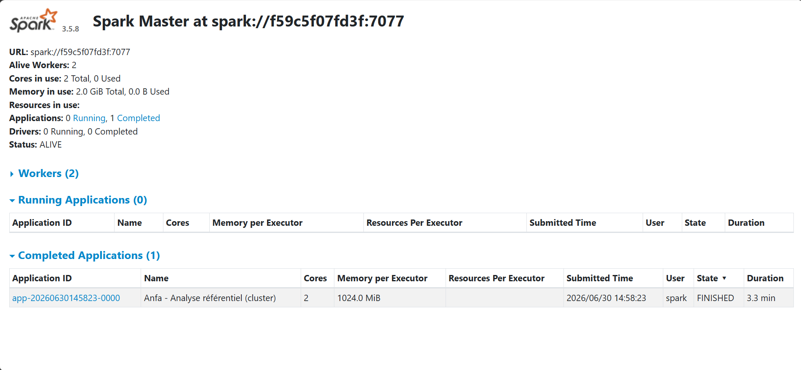
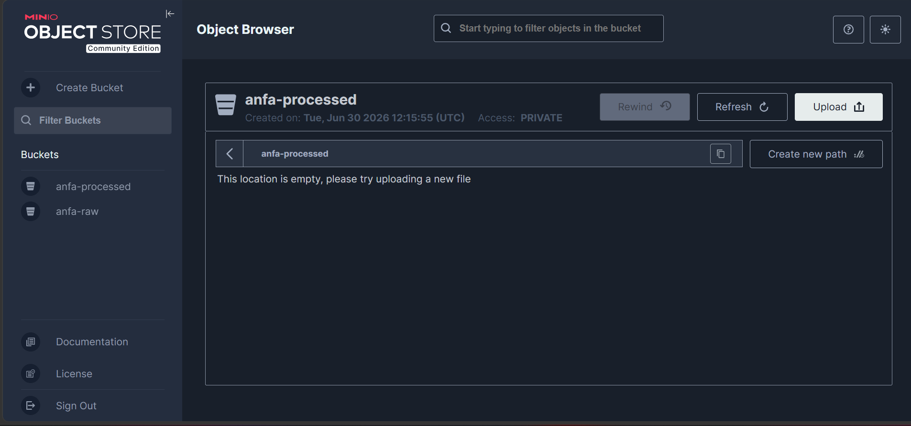
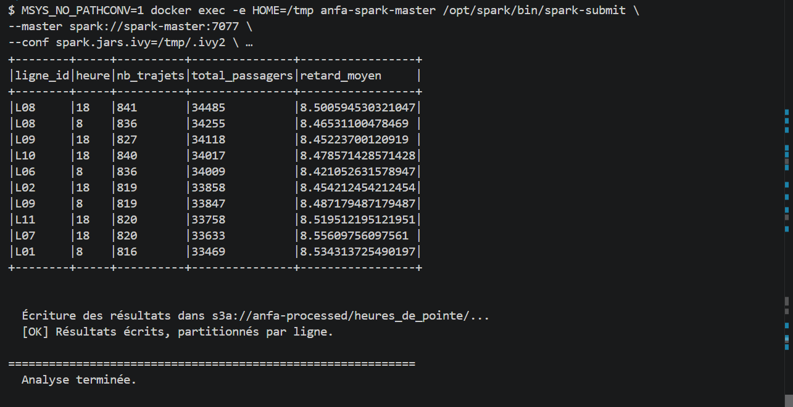
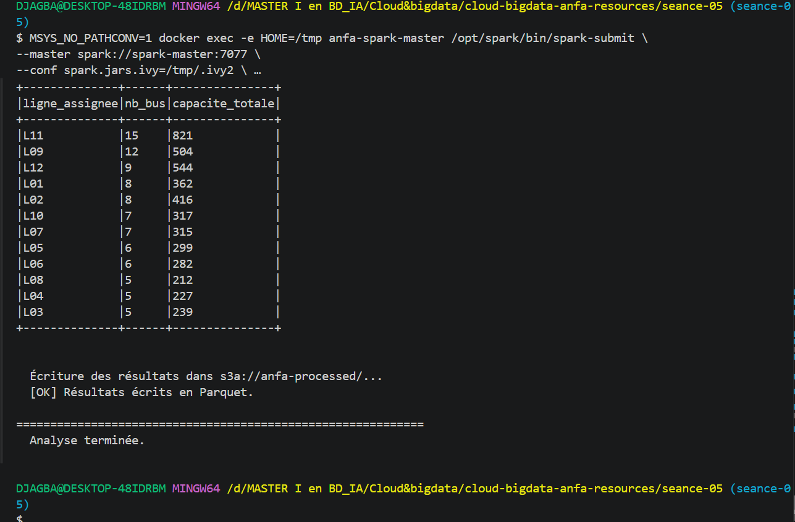

# Nom : DJAGBA Kuinambe Véronique
# Identifiant GitHub : DJAGBA
# Date de soumission : 30/06/2026

## Résumé de la séance 5

## Étapes principales
1. Déploiement du cluster Spark standalone (1 master + 2 workers) via Docker Compose.
2. Préparation de MinIO et upload du référentiel.
3. Premier job distribué (`analyse_referentiel_cluster.py`) : statistiques de base.
4. Génération d'un historique simulé de trajets et job d'analyse des heures de pointe.
5. Comparaison subjective entre mode local et mode cluster.

## Captures d'écran
### Dashboard Spark Master avec 2 workers

### Application Spark exécutée avec succès

### Résultats du Top 10 dans la console

### Bucket anfa-processed avec heures_de_pointe partitionné

## Réflexion : local vs cluster
L'exécution en local est idéale pour développer rapidement et tester de petits volumes de données sans latence réseau, tandis que le mode cluster devient indispensable pour traiter des volumes massifs dépassant la mémoire d'une seule machine, malgré la lenteur ajoutée par la communication entre les nœuds.
## Bonus Spark sur Kubernetes
Non réaliser, car j'avais des difficultés 
