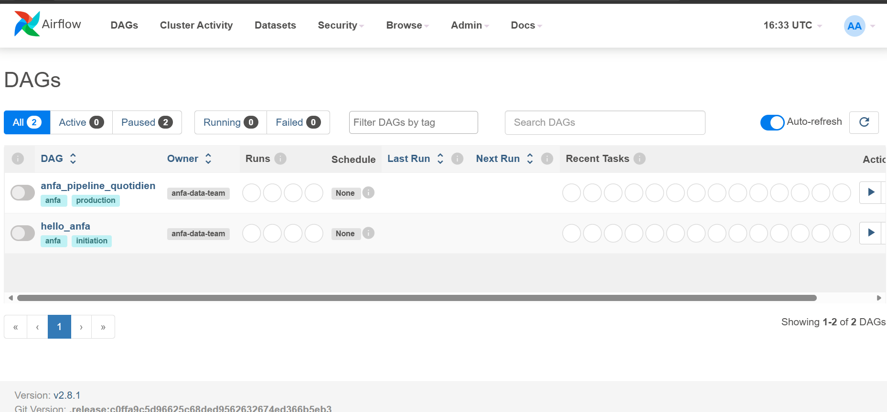
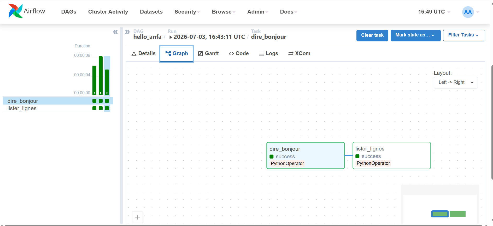
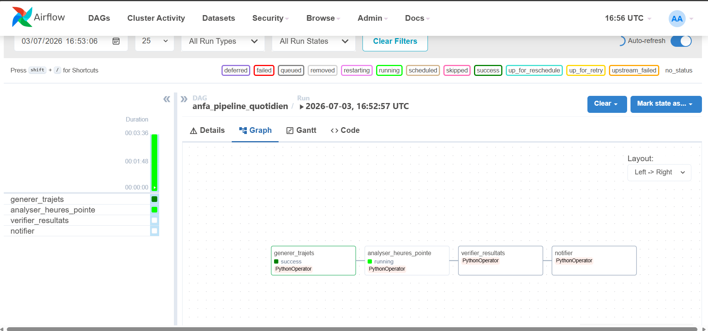

# Rendu : Séance 6

**Nom et prénom :** DJAGBA Kuinambe Véronique
**Identifiant GitHub :** DJAGBA
**Date de soumission :** 03/07/2026

## Résumé de la séance

Airflow déployé via Docker Compose aux côtés de MinIO et Spark. Un premier DAG
simple (`hello_anfa`) a servi à comprendre la mécanique, puis un DAG métier
(`anfa_pipeline_quotidien`) orchestre le pipeline de la séance 5 :
génération → analyse Spark → vérification → notification. Les retries et la
propagation d'échec ont été observés via un bug volontaire.

## Étapes principales

1. Déploiement de la stack (Airflow + PostgreSQL + MinIO + Spark) via Docker Compose.
2. Premier DAG `hello_anfa` à 2 tâches : initiation à la mécanique Airflow.
3. DAG métier `anfa_pipeline_quotidien` à 4 tâches : génération → Spark → vérification → notification.
4. Démonstration des retries et de la gestion d'erreur via un bug volontaire.

## Captures d'écran

### UI Airflow après connexion (vue d'accueil)

### DAG hello_anfa exécuté en succès

### DAG anfa_pipeline_quotidien complet en succès

### Démonstration du retry : tâche en échec et propagation

## Réflexion personnelle

Airflow apporte bien plus qu’un simple cron : il gère les dépendances entre tâches, les retries automatiques en cas d’échec, la visualisation des pipelines et la reprise après correction. Là où cron ne fait qu’exécuter une commande à heure fixe, Airflow orchestre des workflows complexes avec suivi, logs et alertes. On l’utilise sur un vrai projet dès qu’il faut coordonner plusieurs étapes interdépendantes (ETL, analyses Spark, vérifications, notifications) et garantir fiabilité et traçabilité du pipeline.

## Difficultés rencontrées

<Aucune | Décrivez brièvement.>
