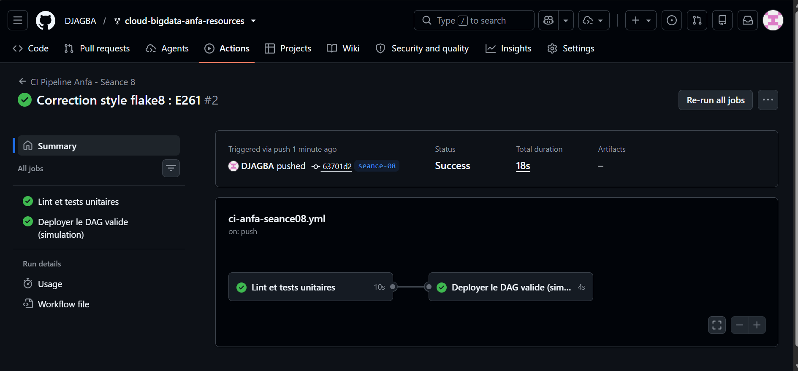
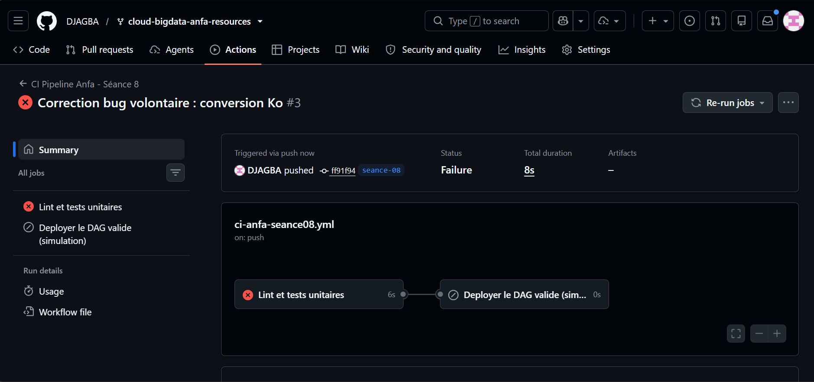

# Rendu — Séance 8

**Nom et prénom :** <Votre nom complet>
**Identifiant GitHub :** <votre-username>
**Date de soumission :** <JJ/MM/AAAA>

## Résumé de la séance

<2-4 lignes : logique métier séparée et testée, pipeline CI/CD GitHub Actions
écrit, démonstration d'un test bloquant le déploiement.>

## Étapes principales

1. Séparation de la logique métier (`anfa_logic.py`) du DAG Airflow.
2. Écriture de 5 tests unitaires avec pytest.
3. Écriture du workflow GitHub Actions (lint + tests + déploiement simulé).
4. Démonstration : un bug volontaire bloque le déploiement ; correction et succès.

## Captures d'écran

### Workflow réussi (2 jobs)

### Job en échec, déploiement non exécuté

## Réflexion personnelle

Ce pipeline aurait empêché l’incident de Mawuli car les tests unitaires auraient détecté l’erreur avant le déploiement, bloquant ainsi la mise en production d’un DAG incorrect. L’instruction needs: dans GitHub Actions force le job de déploiement à attendre le succès du job de validation. Concrètement, cela signifie qu’aucun déploiement n’est possible tant que les tests ne sont pas verts, garantissant la qualité et la fiabilité du pipeline.

## Difficultés rencontrées

<Aucune | Décrivez brièvement.>
