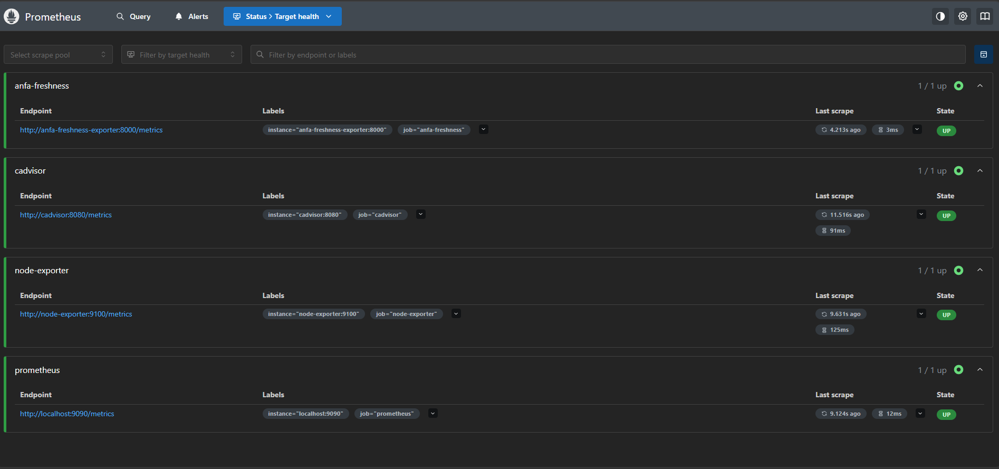
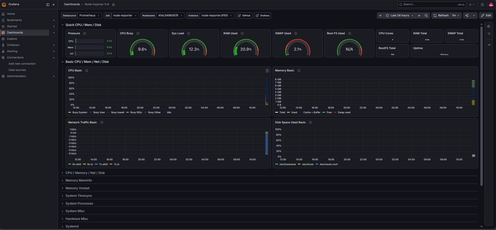
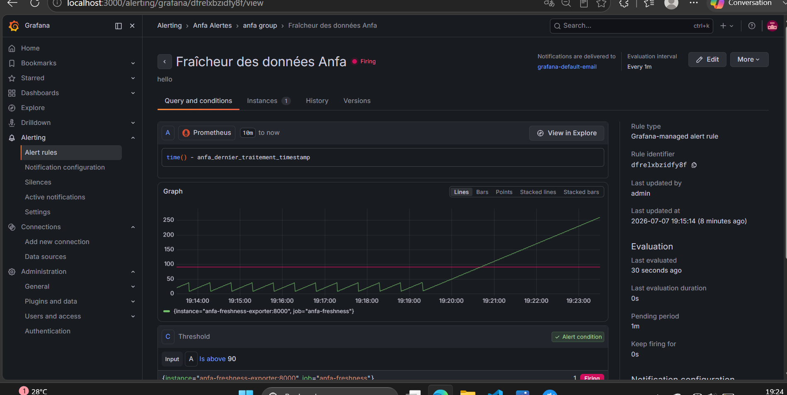

# Rendu — Séance 9

**Nom et prénom :** DJAGBA Kuinambe Véronique
**Identifiant GitHub :** DJAGBA
**Date de soumission :** 07/07/2026

## Résumé de la séance

<2-4 lignes : stack Prometheus/Grafana déployée, exportateur de fraîcheur Anfa
instrumenté, dashboard construit, alerte configurée et déclenchée sur panne simulée.>

## Étapes principales

1. Déploiement de Prometheus, Node Exporter, cAdvisor, Grafana et d'un exportateur
   métier custom (fraîcheur des données Anfa).
2. Exploration des cibles Prometheus et premières requêtes PromQL.
3. Import du dashboard "Node Exporter Full" et construction d'un panneau custom.
4. Configuration d'une alerte Grafana sur la fraîcheur des données.
5. Simulation d'une panne silencieuse et observation du déclenchement de l'alerte.

## Captures d'écran

### Les 4 cibles Prometheus à l'état UP

### Dashboard "Node Exporter Full" importé

### Alerte à l'état Firing après panne simulée

## Réflexion personnelle

La séance illustre parfaitement le problème rencontré par Awa : un pipeline techniquement “succès” mais produisant un résultat vide. Ici, la jauge de fraîcheur montre qu’un exportateur peut rester actif sans générer de données utiles. Ce type de panne silencieuse échappe aux métriques classiques (CPU, RAM, conteneurs en cours d’exécution), mais l’observabilité permet de la détecter rapidement. On gagne ainsi un temps précieux et on évite que l’utilisateur final découvre l’incident en premier.

## Difficultés rencontrées

<Aucune | Décrivez brièvement.>
